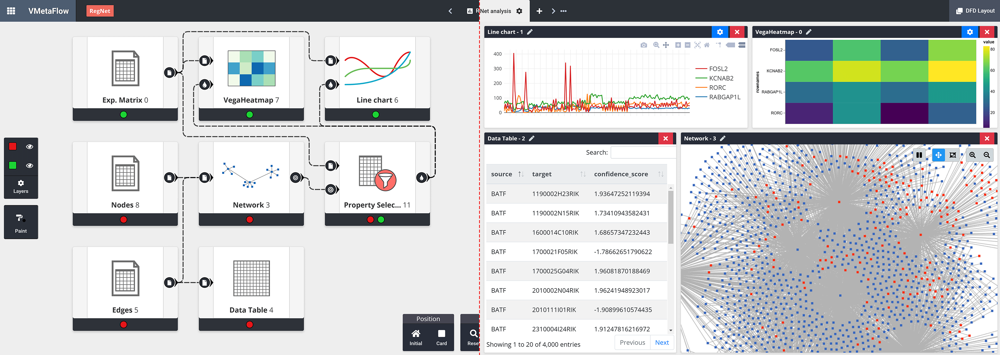

# VMetaFlow

VMetaFlow is a graphical meta-framework to design interactive and coordinated views applications for data visualisation. Our meta-framework is an abstraction layer placed over existing visual grammars and visualisation declarative languages, providing them with interoperability mechanisms. The main contribution of this research is to provide a user-friendly system to design visualisation and data processing operations that can be interconnected to form data analysis workflows. Visualisations and data processes can be saved as cards. Cards and workflows can be saved, distributed and reused between users.
## Dependencies

* **Docker 1.12** or above
* **Web Browser** with HTML5, CSS3, JavaScript with ECMAScript 2015 (ES6) support (any up-to-date version of Google Chrome, Mozilla Firefox or Microsoft Edge)

## Building
1. Download the current project:
   > git clone https://github.com/VMetaFlow/VMetaFlow.git
2. From the project's root directory, build the docker image:
   > docker build -t vmetaflow .
3. Create the docker container from the previous image:
   > docker create --name vmetaflow -p 80:80 vmetaflow
## Running
In order to start the app use:
> docker start -i vmetaflow

Now the tool will be available at `http://localhost:80`

Web Browser extensions may interfere in VMetaFlow's performance or functionality. If you have problems, please disable any extension that may interfere with the web-app.

To stop VMetaFlow use:
> docker stop vmetaflow